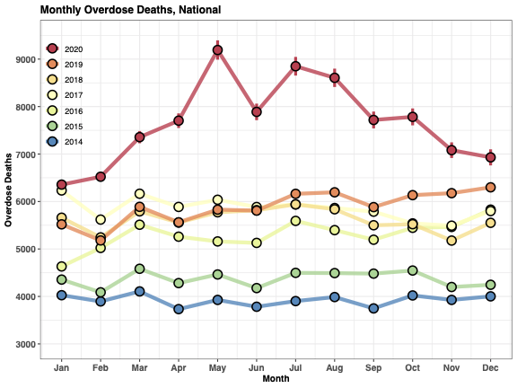

# Code for "COVID-19 and the Drug Overdose Crisis: Uncovering the Deadliest Months in the United States, January-July 2020"

- Overdose data by state for analysis purposes in: `Useable_Overdose_Data_Through_Sep_2020.csv`

## Monthly Overdose Deaths From January 2014 to September 2020: United States

## Monthly Overdose Deaths From January 2014 to September 2020: Select U.S. States

## Directory Layout
- __src/:__ Contains python scripts used in analysis
    - __defilter_data.py:__ Disaggregates rolling sum data
    - __estimate_error.py:__ Calculates error in disaggregation process from historical data
    - __load_data.py:__ Cleans and preprocesses input datasets
    - __tests/:__ Unit tests to ensure desired functions work as intended
- __input/:__ Input datafiles used for analysis
- __output/:__ Generated intermediate files
- __visuals/:__ Generated figures and tables
- __CDC_overdose_monthly_recovery.ipynb:__ Python notebook used to disaggregate CDC overdose death data and calculate errors in that process
- __CDC_monthly_imputation.R:__ Imputes missing data from monthly "ground truth" overdose data
- __CDC_monthly_recovery_analysis.R:__ Run analysis and visualizations of monthly overdose data. Used to generate figures in manuscript.

## Programming Environment

__Python 3.7.6__ 
- pandas==1.2.0
- numpy==1.19.4
- scipy==1.5.4
- matplotlib==3.3.3
- seaborn==0.11.1
- jupyterlab==3.0.0 . 

__R 4.0.3__  

## Steps For Analysis
1. Set up R and python environments
2. Create an empty folder `output` and `visuals` inside of repository
    - Intermediate files  and manuscript figures will be placed here
3. Run `CDC_monthly_imputation.R`
    - Make sure to change `root` variable to point to location of this repository on your local system
3. Run the full `CDC_overdose_monthly_recovery.ipynb` python notebook
4. Run `CDC_monthly_recovery_analysis.R`
    - Make sure to change `root` variable to point to location of this repository on your local system
